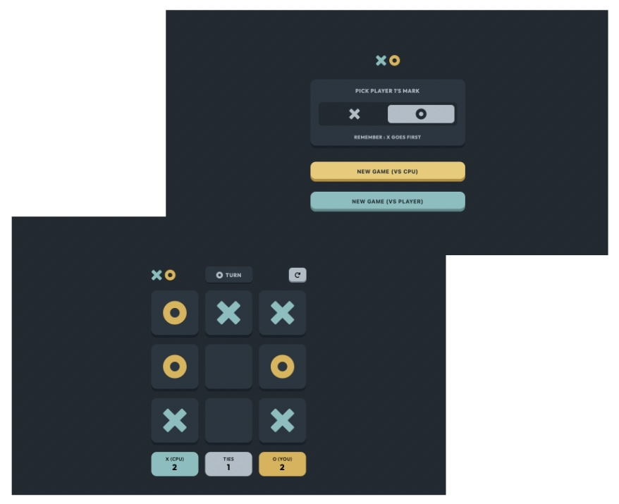

# Frontend Mentor - Tic Tac Toe solution

This is a solution to the [Tic Tac Toe challenge on Frontend Mentor](https://www.frontendmentor.io/challenges/tic-tac-toe-game-Re7ZF_E2v). Frontend Mentor challenges help you improve your coding skills by building realistic projects.

## Table of contents

- [Overview](#overview)
  - [The challenge](#the-challenge)
  - [Screenshot](#screenshot)
  - [Links](#links)
- [My process](#my-process)
  - [Built with](#built-with)
  - [What I learned](#what-i-learned)
  - [Useful resources](#useful-resources)
  - [AI Collaboration](#ai-collaboration)
- [Author](#author)

## Overview

### The challenge

Users should be able to:

- View the optimal layout for the game depending on their device's screen size
- See hover states for all interactive elements on the page
- Play the game either solo vs the computer or multiplayer against another person
- **Bonus 1**: Save the game state in the browser so that it’s preserved if the player refreshes their browser
- **Bonus 2**: Instead of having the computer randomly make their moves, try making it clever so it’s proactive in blocking your moves and trying to win

### Screenshot

### Links

- Solution URL: [Solution](https://github.com/vince4dev/challenge21)
- Live Site URL: [Live site](https://vince4dev.github.io/challenge21/)

## My process

### Built with

- Semantic HTML5 markup
- CSS custom properties
- Flexbox
- CSS Grid
- Mobile-first workflow
- Javascript

### What I learned

Architecture & Organisation

- Séparation métier/UI : gameState (source of truth) vs DOM (rendu)
- Architecture "state-based" : toute la logique dépend d'un objet d'état central, le DOM est mis à jour en conséquence

JavaScript

- Minimax algorithm : IA imbattable au morpion : exploration récursive de tous les coups possibles avec évaluation du score, pruning par depth pour favoriser les victoires rapides
- localStorage : persistance de l'état de jeu (board, scores, tour, type de partie) pour résister à un refresh navigateur
- Pattern guard clauses : early returns pour les états invalides (cellule déjà remplie, overlay actif, tour CPU en cours)
- Dynamic property access : DOM.scores[gameState.playerSymbol] pour adresser le bon élément sans condition
- setTimeout : délais réalistes pour le jeu CPU et l'affichage des messages

CSS

- CSS custom properties — thème cohérent via --clr-_, --spacing-_, --box-shadow-\*
- Mask-image : coloration d'icônes SVG sans modifier les fichiers sources : le SVG sert de pochoir, background-color remplit la forme
- Stacking context : gestion de z-index pour superposer overlay, message et plateau sans interférence
- Pseudo-éléments ::after : superposition d'icônes sur les cellules sans alourdir le HTML
- Animations @keyframes : pulse sur les cellules gagnantes avec box-shadow variable selon le joueur
- Transitions CSS : overlay avec fade-in/out fluide

Accessibilité

- aria-label sur les inputs radio et les boutons
- Sémantique HTML ( section, button, fieldset, legend )

Bonus

- Mode CPU et mode 2 joueurs avec sélection du symbole (X ou O)
- Gestion des tours : X commence toujours, le CPU joue automatiquement si c'est à lui
- Sauvegarde/restauration complète de l'état après refresh

### Useful resources

- [google-webfonts-helper](https://gwfh.mranftl.com/fonts) - This helped me find the font and integrate it into the project.
- [MDN](https://developer.mozilla.org/fr/) - Resources for Developers.

### AI Collaboration

- Open Code with DeepSeek V4 Flash Free

## Author

- Frontend Mentor - [@vince4dev](https://www.frontendmentor.io/profile/vince4dev)
